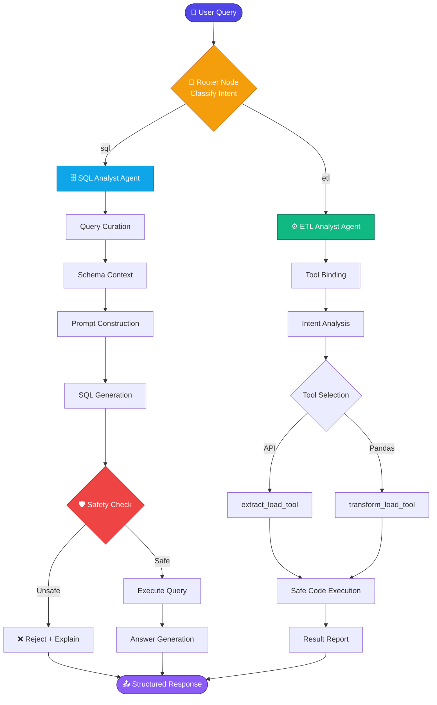

<div align="center">

# 🤖 Agentic AI — Data Agent

### *A multi-agent system that turns plain English into SQL queries and ETL pipelines.*

<p align="center">
  
  
  
</p>

<p align="center">
  
  
  
  
  
</p>

<p align="center">
  <b>Ask a question. Get an answer. No SQL. No boilerplate. No glue code.</b>
</p>


</div>

<br/>

## 🌟 What Is This?

> **Agentic AI Data Agent** is an intelligent orchestration system that reads a natural-language request, figures out *what kind of work it is*, and hands it to the right specialist agent.

Ask it `"Show me the top 5 users by rating"` → the **SQL Analyst** writes, validates and runs the query.
Ask it `"Pull the Pokémon API into CSV"` → the **ETL Analyst** extracts, transforms and loads it.

No mode switching. No prompt engineering. Just ask.

<table>
<tr>
<td width="33%" align="center">

### 🧠
**Intelligent Routing**

Understands intent and dispatches to the right sub-agent automatically.

</td>
<td width="33%" align="center">

### 🛡️
**Safety First**

Blocks `DROP`, `DELETE`, `UPDATE` and every other destructive operation before execution.

</td>
<td width="33%" align="center">

### ⚡
**Cost-Aware LLMs**

Simple task? Cheap model. Complex task? Claude. Automatically.

</td>
</tr>
</table>

<br/>


## 📚 Table of Contents

<details open>
<summary><b>Click to expand / collapse</b></summary>

<br/>

| Section | Description |
|:--------|:------------|
| [🏗️ Architecture](#️-architecture) | How the agents fit together |
| [✨ Features](#-features) | What the system can do |
| [🚀 Quick Start](#-quick-start) | Running in under 5 minutes |
| [📁 Project Structure](#-project-structure) | Directory layout |
| [⚙️ Configuration](#️-configuration) | Env vars, LLMs, database |
| [💻 Usage](#-usage) | Code examples |
| [🤖 The Agents](#-the-agents) | Deep dive into each agent |
| [📊 Data Models](#-data-models) | Pydantic state schemas |
| [🎬 Examples](#-examples) | End-to-end walkthroughs |
| [🔐 Security](#-security) | Safety guarantees |
| [🚨 Troubleshooting](#-troubleshooting) | Common issues |
| [🗺️ Roadmap](#️-roadmap) | What's next |
| [🤝 Contributing](#-contributing) | How to help |

</details>

<br/>


## 🏗️ Architecture

A hierarchical, supervisor-style agent graph built on **LangGraph**.



<details>
<summary><b>🔄 State Flow — step by step</b></summary>

<br/>

```
┌───────────────────────────────────────────────────────────────┐
│  1️⃣  USER INPUT        Natural language query                  │
├───────────────────────────────────────────────────────────────┤
│  2️⃣  ROUTER NODE       Structured output → "sql" | "etl"       │
├───────────────────────────────────────────────────────────────┤
│  3️⃣  AGENT DISPATCH    Conditional edge to the sub-agent       │
├───────────────────────────────────────────────────────────────┤
│  4️⃣  PROCESSING        Agent runs its internal node graph      │
├───────────────────────────────────────────────────────────────┤
│  5️⃣  OUTPUT            Validated, structured result            │
└───────────────────────────────────────────────────────────────┘
```

</details>

<br/>


## ✨ Features

<table>
<tr><th width="25%">Capability</th><th>What It Does</th></tr>

<tr>
<td><b>🧭 Smart Routing</b></td>
<td>Classifies any incoming query as a database operation or a data-pipeline operation using structured LLM output — no keyword matching.</td>
</tr>

<tr>
<td><b>🗄️ SQL Analysis</b></td>
<td>Natural language → SQL. Auto-fetches live schema context, refines ambiguous questions, generates the query, validates it, executes it, and formats the answer in prose.</td>
</tr>

<tr>
<td><b>⚙️ ETL Pipelines</b></td>
<td>Extracts from REST APIs, normalizes nested JSON, transforms with dynamically generated Pandas code, and loads to CSV / JSON / Parquet.</td>
</tr>

<tr>
<td><b>🎚️ Multi-LLM Tiering</b></td>
<td>Routes by complexity — <code>low</code> for cheap and fast, <code>medium</code> for balanced, <code>claude</code> for heavy reasoning.</td>
</tr>

<tr>
<td><b>🛡️ Safety Layer</b></td>
<td>Every generated query passes a validation node. Destructive DDL/DML never reaches the database.</td>
</tr>

<tr>
<td><b>📐 Typed State</b></td>
<td>All agent state is Pydantic-validated. No silent shape drift between nodes.</td>
</tr>

</table>

<br/>


## 🚀 Quick Start

### Prerequisites

| Requirement | Version | Notes |
|:------------|:--------|:------|
| 🐍 Python | `3.12+` | Required |
| 🐘 PostgreSQL | `14+` | For SQL agent |
| 🔑 Anthropic API Key | — | For high-complexity tier |
| 🔑 OpenAI API Key | — | For low / medium tiers |

<br/>

### 1️⃣ &nbsp;Clone & Create Environment

```bash
git clone <your-repo-url>
cd Agentic_AI_Project
python -m venv .venv
```

<details>
<summary><b>Activate the virtual environment</b></summary>

<br/>

**Windows (PowerShell)**
```powershell
.\.venv\Scripts\Activate.ps1
```

**macOS / Linux**
```bash
source .venv/bin/activate
```

</details>

### 2️⃣ &nbsp;Install Dependencies

```bash
uv pip install -r requirements.txt
# or
pip install -e .
```

<details>
<summary><b>📦 What gets installed</b></summary>

<br/>

| Package | Role |
|:--------|:-----|
| `langchain` | Core LLM framework |
| `langgraph` | Multi-agent orchestration |
| `langchain-anthropic` | Claude integration |
| `langchain-openai` | OpenAI integration |
| `pandas` | Data transformation engine |
| `psycopg2` | PostgreSQL driver |
| `pydantic` | State validation |
| `python-dotenv` | Env configuration |

</details>

### 3️⃣ &nbsp;Configure Environment

Copy the example file and fill in your local values:

```bash
cp .env.example .env
```

Then update the `.env` file in the root directory:

```env
# ─── 🔑 LLM Configuration ──────────────────────────
ANTHROPIC_API_KEY=your_claude_api_key
OPENAI_API_KEY=your_openai_api_key

# ─── 🐘 Database Configuration ─────────────────────
host=localhost
port=5432
user=postgres
password=your_password
database=data_agent_db

# ─── 🎚️ Optional: Model Tiers ──────────────────────
LLM_MODEL_LOW=gpt-3.5-turbo
LLM_MODEL_MEDIUM=gpt-4-turbo
LLM_MODEL_HIGH=claude-3-opus
```

> [!WARNING]
> Never commit your `.env` file. Add it to `.gitignore` before your first push.

### 4️⃣ &nbsp;Seed the Database & Run

```bash
python feed_db.py   # loads the sample CSVs into PostgreSQL
python main.py      # 🚀 launch the agent
```

<br/>


## 📁 Project Structure

```
Data_Agent/
│
├── 🤖 agents/                    # Agent implementations
│   ├── __init__.py
│   ├── data_agent.py            # 🧭 Main router agent
│   ├── sql_analyst.py           # 🗄️ SQL query agent
│   └── etl_analyst.py           # ⚙️ ETL operations agent
│
├── 📐 Models/                    # Pydantic state schemas
│   ├── __init__.py
│   └── schema.py
│
├── 🛠️ utils/                     # Shared utilities
│   ├── __init__.py
│   ├── database.py              # PostgreSQL helpers
│   ├── etl_tools.py             # ETL toolkit (@tool defs)
│   └── llm_pick.py              # LLM tier selection
│
├── 📊 data/                      # Data workspace
│   ├── extract/                 # ← API extraction output
│   ├── transform/               # ← Transformation output
│   ├── payments.csv
│   ├── ratings.csv
│   ├── rides.csv
│   ├── users.csv
│   └── vehicles.csv
│
├── 🚪 main.py                    # Entry point
├── 🌱 feed_db.py                 # DB initialization
├── 📦 pyproject.toml             # Metadata & dependencies
└── 📖 README.md
```

<br/>


## ⚙️ Configuration

### 🎚️ LLM Tier Selection

`pick_llm()` chooses a model based on the complexity of the task at hand:

```python
from utils.llm_pick import pick_llm

llm_fast     = pick_llm("low")     # ⚡ Cheap & fast — routing, classification
llm_balanced = pick_llm("medium")  # ⚖️ Balanced — SQL generation
llm_powerful = pick_llm("claude")  # 🧠 Premium — complex reasoning, code gen
```

| Tier | Use Case | Trade-off |
|:-----|:---------|:----------|
| `low` | Routing, simple lookups | 💰 Lowest cost, fastest |
| `medium` | SQL generation, schema reasoning | ⚖️ Balanced |
| `claude` | Multi-step ETL, code generation | 🧠 Highest quality |

### 🐘 Database Setup

```python
from utils.database import DatabaseUtil

conn_details = {
    "host":     "localhost",
    "port":     5432,
    "user":     "postgres",
    "password": "password",
    "dbname":   "data_agent_db",
}

db = DatabaseUtil(conn_details)
schema_info = db.schema_details("public")
```

<br/>


## 💻 Usage

### 🗄️ SQL Query

```python
from agents.data_agent import data_agent
from langchain_core.messages import HumanMessage

response = data_agent.invoke({
    "messages": [
        HumanMessage(content="Show me the top 5 users with the highest ratings")
    ],
    "route_response": "",
})

print(response)
```

### 📥 API Extraction

```python
response = data_agent.invoke({
    "messages": [
        HumanMessage(content="""
            Extract the data from 'https://pokeapi.co/api/v2/pokemon'
            and save it to the data/extract folder in CSV format
        """)
    ],
    "route_response": "",
})
```

### 🔄 Data Transformation

```python
response = data_agent.invoke({
    "messages": [
        HumanMessage(content="""
            Transform rides.csv by filtering only rides with rating > 4.5
            and save the result to data/transform
        """)
    ],
    "route_response": "",
})
```

### 🖥️ From the Command Line

```bash
python main.py                    # 🚀 Full router agent
python agents/sql_analyst.py      # 🗄️ SQL agent standalone
python agents/etl_analyst.py      # ⚙️ ETL agent standalone
```

<br/>


## 🤖 The Agents

<details open>
<summary><h3>🧭 &nbsp;1. Data Agent — The Router</h3></summary>

**File:** `agents/data_agent.py`

The supervisor. Reads intent, decides who handles it, aggregates the result.

| Component | Role |
|:----------|:-----|
| **Router Node** | Structured output classification → `"sql"` or `"etl"` |
| **Conditional Edge** | Dispatches to the matching sub-agent |
| **Graph Orchestration** | LangGraph state machine managing the whole flow |

</details>

<details>
<summary><h3>🗄️ &nbsp;2. SQL Analyst Agent</h3></summary>

**File:** `agents/sql_analyst.py`

Turns questions into validated, executed SQL.

```
1. Query Curation      →  Refine the raw question for clarity
2. Context Gathering   →  Pull live schema from PostgreSQL
3. Prompt Construction →  Build a rich, grounded context block
4. SQL Generation      →  LLM writes the query
5. Safety Check   🛡️   →  Validate before anything touches the DB
6. Query Execution     →  Run it
7. Answer Generation   →  Format results as readable prose
```

**Safety features**

- 🚫 Blocks `INSERT`, `UPDATE`, `DELETE`, `DROP`, `ALTER`
- ✅ Validates every query before execution
- 🔢 Auto-limits results to 10 rows unless told otherwise
- 📐 Validates generated SQL against the real schema

</details>

<details>
<summary><h3>⚙️ &nbsp;3. ETL Analyst Agent</h3></summary>

**File:** `agents/etl_analyst.py`

Extraction, transformation and loading — driven entirely by tool calls.

```
1. Tool Binding        →  Attach ETL tools to the LLM
2. Intent Analysis     →  Understand the transformation goal
3. Tool Selection      →  Pick extract vs. transform
4. Code Generation     →  Write Pandas code on the fly
5. Safe Execution 🛡️   →  Run in a controlled environment
6. Result Reporting    →  Return status + generated code
```

**Available tools**

| Tool | Purpose |
|:-----|:--------|
| `extract_load_tool` | REST API → normalized → storage |
| `transform_load_tool` | Pandas transformation → storage |

**Output formats:** `CSV` *(default)* · `JSON` *(Lines or Records)* · `Parquet`

</details>

<br/>


## 📊 Data Models

All agent state is typed and validated with **Pydantic**.

<details open>
<summary><b>🗄️ AgentSchema</b> — SQL agent state</summary>

<br/>

```python
class AgentSchema(BaseModel):
    messages: List                    # 💬 Conversation messages
    user_question: str                # ❓ Original user query
    curated_ques: str                 # ✏️  Refined question
    prompt_query_context: str         # 📚 Database context + prompt
    generated_sql_query: str          # 🗄️  Generated SQL
    is_safe: Literal["Yes", "No"]     # 🛡️  Safety validation result
    comments: str                     # 💭 Safety check reasoning
    sql_query_execution_result: str   # 📊 Raw query result
    final_answer: str                 # ✅ Formatted answer
```

</details>

<details>
<summary><b>⚙️ ETLAgentSchema</b> — ETL agent state</summary>

<br/>

```python
class ETLAgentSchema(BaseModel):
    messages: List                    # 💬 Conversation messages
```

</details>

<details>
<summary><b>🧭 RouterSchema</b> — Query classification</summary>

<br/>

```python
class RouterSchema(BaseModel):
    answer: Literal["sql", "etl"]     # 🎯 Classification
    comments: str                     # 💭 Reasoning
```

</details>

<details>
<summary><b>🤖 DataAgentSchema</b> — Main agent state</summary>

<br/>

```python
class DataAgentSchema(BaseModel):
    messages: List                    # 💬 All conversation messages
    route_response: str               # 🧭 Router decision
```

</details>

<br/>


## 🎬 Examples

<details open>
<summary><h3>📊 Example 1 — Database Query</h3></summary>

> 💬 **You:** *"Show me the average rating for each vehicle type"*

```
🧭 Router          →  classified as SQL
🗄️  SQL Agent      →  fetching schema...
✏️  Generated      →  SELECT vehicle_type, AVG(rating)
                      FROM rides
                      GROUP BY vehicle_type
                      LIMIT 10
🛡️  Safety Check   →  ✅ PASSED
⚡ Execution       →  4 rows returned
📤 Answer          →  formatted response
```

</details>

<details>
<summary><h3>📥 Example 2 — API Extraction</h3></summary>

> 💬 **You:** *"Extract the data from 'https://pokeapi.co/api/v2/pokemon' and save it as CSV"*

```
🧭 Router          →  classified as ETL
⚙️  ETL Agent      →  selected extract_load_tool
🌐 API Request     →  GET https://pokeapi.co/api/v2/pokemon
🔧 Normalize       →  flattening nested JSON
💾 Saved           →  data/extract/extracted_data.csv
```

</details>

<details>
<summary><h3>🔄 Example 3 — Data Transformation</h3></summary>

> 💬 **You:** *"Transform rides.csv to filter only rides with rating > 4.0 and save as JSON"*

```
🧭 Router          →  classified as ETL
⚙️  ETL Agent      →  analyzing requirement
🐼 Code Gen        →  df[df['rating'] > 4.0]
🛡️  Safe Exec      →  sandboxed run ✅
💾 Saved           →  data/transform/output.json
```

</details>

<br/>


## 🔐 Security

| ✅ | Guarantee | How |
|:--:|:----------|:----|
| 🛡️ | **SQL Safety Validation** | Every query is inspected by a dedicated validation node before execution. Destructive operations are rejected with an explanation. |
| 🧪 | **Safe Code Execution** | Generated Pandas code runs in a controlled environment with input validation and full error capture. |
| 🔑 | **Credential Isolation** | All secrets live in `.env`, never in source. |
| 📐 | **Typed Boundaries** | Pydantic validation on every state transition prevents malformed data propagation. |

> [!IMPORTANT]
> The safety layer is a strong guardrail, not a substitute for database permissions. Always connect with a **read-only** role in production.

<br/>


## 🛠️ Development

<details>
<summary><b>➕ Adding a New Agent</b></summary>

<br/>

1. Create the agent file in `agents/`
2. Define its state schema in `Models/schema.py`
3. Implement the nodes using LangGraph
4. Register the routing logic in `data_agent.py`
5. Update this README

</details>

<details>
<summary><b>🔧 Extending the ETL Toolkit</b></summary>

<br/>

Add new tools in `utils/etl_tools.py`:

```python
from langchain_core.tools import tool

@tool
def new_tool(param: str) -> str:
    """Clear, specific description — the LLM reads this to decide when to call it."""
    ...
```

</details>

<details>
<summary><b>🎚️ Customizing LLM Selection</b></summary>

<br/>

Edit `utils/llm_pick.py` to tune:

- Model selection criteria
- Temperature and sampling parameters
- Token limits
- Response format enforcement

</details>

<br/>


## 📝 Environment Variables

| Variable | Description | Example |
|:---------|:------------|:--------|
| `ANTHROPIC_API_KEY` | 🔑 Claude API key | `sk-ant-...` |
| `OPENAI_API_KEY` | 🔑 OpenAI API key | `sk-...` |
| `host` | 🐘 PostgreSQL host | `localhost` |
| `port` | 🔌 PostgreSQL port | `5432` |
| `user` | 👤 PostgreSQL user | `postgres` |
| `password` | 🔒 PostgreSQL password | `your_password` |
| `database` | 🗄️ Database name | `data_agent_db` |

<br/>


## 🚨 Troubleshooting

<details>
<summary><b>❌ "Database connection failed"</b></summary>

<br/>

Verify PostgreSQL is running and your `.env` credentials are correct.

```bash
pg_isready -h localhost -p 5432
```

</details>

<details>
<summary><b>❌ "API key not found"</b></summary>

<br/>

Confirm your `.env` exists in the project root and is being loaded by `python-dotenv`.

</details>

<details>
<summary><b>❌ "SQL query unsafe"</b></summary>

<br/>

The generated query contained a destructive operation. Rephrase your request as a read-only question — the agent only executes `SELECT`.

</details>

<details>
<summary><b>❌ "Module not found"</b></summary>

<br/>

Activate your virtual environment and reinstall:

```bash
source .venv/bin/activate
uv pip install -r requirements.txt
```

</details>

<br/>


## 📈 Performance Notes

| Area | Recommendation |
|:-----|:---------------|
| ⚡ **Query complexity** | Low-complexity queries route to faster, cheaper models automatically |
| 🗄️ **Database** | Add indexes on frequently filtered columns |
| 🌐 **API calls** | Respect upstream rate limits when extracting |
| 💾 **Memory** | Large transformations may need chunking or Dask |

<br/>


## 🗺️ Roadmap

- [x] Multi-agent routing with LangGraph
- [x] SQL generation with safety validation
- [x] ETL extraction and transformation tools
- [x] Multi-tier LLM selection
- [ ] Conversation memory across turns
- [ ] Streaming responses
- [ ] Web UI dashboard
- [ ] Additional database connectors (MySQL, Snowflake, BigQuery)
- [ ] Automated test suite
- [ ] Query result caching

<br/>


## 🤝 Contributing

Contributions are very welcome. Before opening a PR, please make sure:

- ✅ Code follows the existing style
- ✅ New agents include full docstrings
- ✅ New features define their state schemas
- ✅ Security implications are considered
- ✅ Tests accompany new functionality

```bash
git checkout -b feature/your-feature
git commit -m "feat: add your feature"
git push origin feature/your-feature
```

<br/>


## 🎓 Learning Resources

<p align="center">
  <a href="https://langchain-ai.github.io/langgraph/"></a>
  <a href="https://python.langchain.com/"></a>
  <a href="https://docs.anthropic.com/"></a>
  <a href="https://www.postgresql.org/docs/"></a>
</p>

<br/>


<div align="center">


